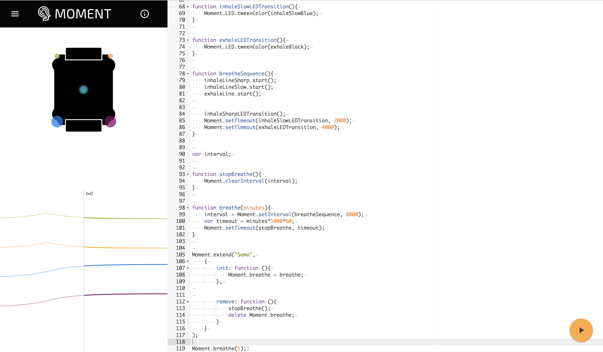

# SwiftMomentSDK

*iOS development kit for [Moment](https://wearmoment.com)*

[](https://github.com/SomaticLabs/SwiftMomentSDK/blob/master/LICENSE)
[](https://github.com/Carthage/Carthage)
[](http://twitter.com/SomaticLabs)

## About

The SwiftMomentSDK allows developers to build iOS applications that communicate with Moment, the first wearable that communicates entirely through your sense of touch. 

This library is made to be used in conjuction with our [embedded Javascript SDK](https://github.com/somaticlabs/moment-sdk).

To get started developing your own haptic animations, check out our [Moment simulator](https://somaticlabs.github.io/moment-sim/).



Animations and programs created in the simulator can be ran on Moment using this library, either by sending a embedding the Javascript directly in your application or by storing your scripts in [Github Gists](https://gist.github.com) and referencing those in your applications. 

For more information regarding using the Moment Javascript SDK, please refer to our [documentation](https://somaticlabs.github.io/moment-sdk/).

## Requirements

- iOS 9.0+
- Xcode 8.1+
- Swift 3.0+

## Troubleshooting & Contributions

- If you **need help**, use our [discussion forum](https://talk.wearmoment.com) or [send us an email](mailto:developers@somaticlabs.io).
- If you'd like to **ask a general question**, use our [discussion forum](https://talk.wearmoment.com) or [send us an email](mailto:developers@somaticlabs.io).
- If you **found a bug**, open an issue.
- If you **have a feature request**, open an issue.
- If you **want to contribute**, submit a pull request.

## Installation

### Carthage

[Carthage](https://github.com/Carthage/Carthage) is a decentralized dependency manager that builds your dependencies and provides you with binary frameworks.

You can install Carthage with [Homebrew](http://brew.sh/) using the following command:

```bash
$ brew update
$ brew install carthage
```

To integrate SwiftMomentSDK into your Xcode project using Carthage, specify it in your `Cartfile`:

```ogdl
github "SomaticLabs/SwiftMomentSDK" ~> 1.0
```

Run `carthage update` to build the framework and drag the built `MomentSDK.framework` into your Xcode project.

## Usage

TODO

## License

The SwiftMomentSDK is released under the [MIT license](https://github.com/SomaticLabs/SwiftMomentSDK/blob/master/LICENSE).
